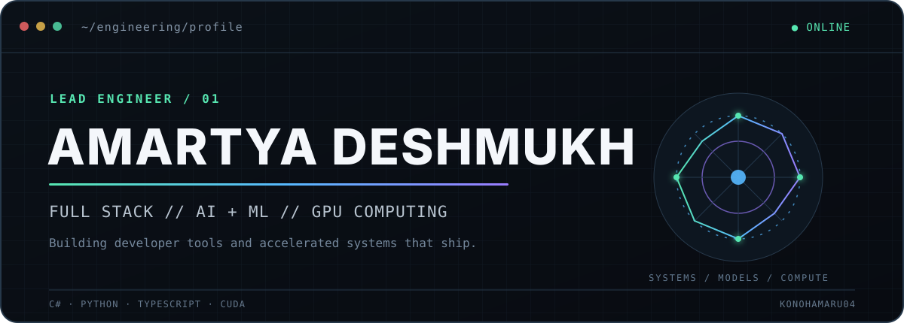
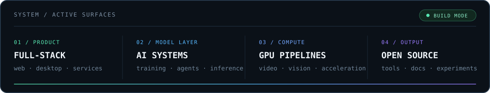
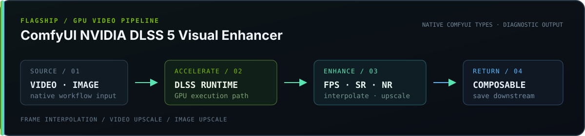

<div align="center">
  <picture>
    <source media="(prefers-color-scheme: dark) and (max-width: 640px)" srcset="./assets/hero-mobile-dark.svg">
    <source media="(prefers-color-scheme: light) and (max-width: 640px)" srcset="./assets/hero-mobile-light.svg">
    <source media="(prefers-color-scheme: dark)" srcset="./assets/hero-dark.svg">
    <source media="(prefers-color-scheme: light)" srcset="./assets/hero-light.svg">
    
  </picture>
</div>

<br>

I’m a **Lead Engineer** building product systems where full-stack software meets AI infrastructure. My work spans developer tooling, local model runtimes, GPU-accelerated media, and the practical engineering required to ship them.

<picture>
  <source media="(prefers-color-scheme: dark) and (max-width: 640px)" srcset="./assets/system-mobile-dark.svg">
  <source media="(prefers-color-scheme: light) and (max-width: 640px)" srcset="./assets/system-mobile-light.svg">
  <source media="(prefers-color-scheme: dark)" srcset="./assets/system-dark.svg">
  <source media="(prefers-color-scheme: light)" srcset="./assets/system-light.svg">
  
</picture>

## `01 / OPERATING DOMAIN`

- **Product engineering** — durable web and desktop applications, from interface architecture through backend services and deployment.
- **Applied AI** — local inference, model training, agent workflows, and tools that make advanced models useful outside a notebook.
- **Accelerated media** — GPU-first image and video pipelines built around measurable output, explicit runtime contracts, and real hardware constraints.

## `02 / TOOLCHAIN`

**LANGUAGES**<br>
`C#` · `Python` · `TypeScript` · `JavaScript` · `SQL`

**APPLICATION SYSTEMS**<br>
`.NET` · `ASP.NET` · `Angular` · `React` · `Node.js` · `Tauri` · `Electron`

**AI + GPU**<br>
`PyTorch` · `CUDA` · `OpenCV` · `ONNX Runtime` · `FFmpeg` · `ComfyUI` · `local LLM tooling`

**DATA + DELIVERY**<br>
`SQL Server` · `SQLite` · `Azure` · `Docker` · `GitHub Actions`

## `03 / FEATURED BUILDS`

<a href="https://github.com/Konohamaru04/ComfyUI-NVIDIA-DLSS-Frame-Interpolation">
  <picture>
    <source media="(prefers-color-scheme: dark) and (max-width: 640px)" srcset="./assets/dlss-pipeline-mobile-dark.svg">
    <source media="(prefers-color-scheme: light) and (max-width: 640px)" srcset="./assets/dlss-pipeline-mobile-light.svg">
    <source media="(prefers-color-scheme: dark)" srcset="./assets/dlss-pipeline-dark.svg">
    <source media="(prefers-color-scheme: light)" srcset="./assets/dlss-pipeline-light.svg">
    
  </picture>
</a>

### [ComfyUI NVIDIA DLSS 5 Visual Enhancer](https://github.com/Konohamaru04/ComfyUI-NVIDIA-DLSS-Frame-Interpolation)

Native NVIDIA DLSS processing for ComfyUI: frame interpolation, video upscaling, and image upscaling exposed as composable nodes. The project connects GPU runtime integration to practical video workflows, including deterministic frame-rate conversion, encoding, audio retention, diagnostics, and experimental Linux support through Wine.

`Python` · `NVIDIA DLSS` · `ComfyUI` · `FFmpeg` · `GPU video`

---

### [Tiny-LLM](https://github.com/Konohamaru04/Tiny-LLM)

A compact GPT-style language model built from scratch in PyTorch, covering tokenizer training, pretraining, supervised fine-tuning, evaluation, and local inference. Its architecture explores modern small-model ideas including grouped-query attention, RoPE, RMSNorm, and sparse mixture-of-experts routing.

`PyTorch` · `Transformers` · `BPE` · `CUDA` · `Model training`

---

### [Computer-Use-Agent](https://github.com/Konohamaru04/Computer-Use-Agent)

A local desktop-control agent for Ollama vision models. It turns natural-language tasks into a bounded **observe → plan → act → verify** loop, pairing a Tauri + React interface with a Python worker, validated actions, screenshots, and an MCP surface.

`Python` · `Tauri` · `React` · `TypeScript` · `Ollama` · `MCP`

## `04 / ENGINEERING SIGNAL`

```text
INPUT   ambiguous product and systems problems
METHOD  model the contract · isolate the bottleneck · measure the result
OUTPUT  maintainable software that works on real machines
```

I’m most interested in work that crosses boundaries: UI and runtime, model and product, managed code and native acceleration. The through-line is practical systems thinking—understand the whole path, then make the critical path better.

## `05 / OPEN SOURCE`

Project work is the primary telemetry here. Browse the repositories, implementation notes, validation evidence, and active experiments directly on [GitHub](https://github.com/Konohamaru04?tab=repositories).

<div align="center">
  <sub>AMARTYA DESHMUKH · LEAD ENGINEER · BUILT WITH INTENT, NOT BADGES</sub>
</div>
